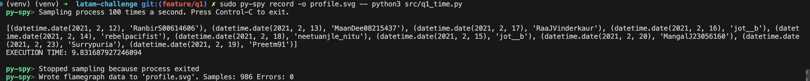
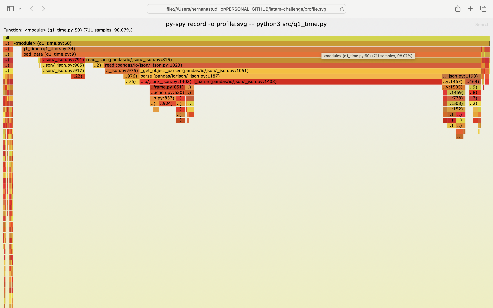
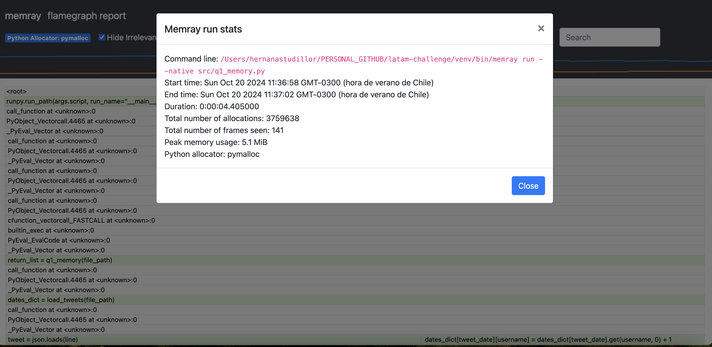

# En este archivo encontrarás todas las instrucciones para ejecutar el proyecto.

## 0. Descargar el archivo con los Tweets
Debes utilizar los datos contenidos en el siguiente [siguiente archivo](https://drive.google.com/file/d/1ig2ngoXFTxP5Pa8muXo02mDTFexZzsis/view?usp=sharing)
y meterlo dentro de la carpeta /data

## 1. Crear un entorno virtual
Para asegurarte de que las dependencias del proyecto estén controladas y aisladas, es recomendable trabajar con un entorno virtual.

1. Abre la terminal de VSCode (o cualquier terminal que prefieras).
2. Navega a la raíz del proyecto `latam-challenge`:

    ```bash
    cd /path/to/latam-challenge
    ```

3. Crea un entorno virtual usando el módulo `venv` (Python 3.10):

    ```bash
    python3.10 -m venv venv
    ```

    Esto creará un entorno virtual en una carpeta llamada `venv`.

## 2. Activar el entorno virtual
Una vez creado, debes activar el entorno virtual para que Python utilice las dependencias específicas de tu proyecto.

- **En macOS/Linux**:

    ```bash
    source venv/bin/activate
    ```

Al activar el entorno virtual, deberías ver algo como `(venv)` al inicio de la línea de tu terminal, indicando que el entorno está activo.

## 3. Instalar las dependencias
En el archivo `requirements.txt` están listadas las dependencias necesarias. Instálalas usando `pip`:

1. Asegúrate de que el entorno virtual está activado.
2. Ejecuta el siguiente comando para instalar las dependencias:

    ```bash
    pip install -r requirements.txt
    ```

Esto instalará todos los paquetes necesarios para el proyecto.


## 4. Instalar las py-spy
En el archivo `requirements.txt` están listadas las dependencias necesarias. Instálalas usando `pip`:

1. Asegúrate de que el entorno virtual está activado.
2. Ejecuta el siguiente comando para instalar  en MacOs:

    ```bash
    brew install py-spy
    ```


## 5 ejecutar el primer q1_time.py
Para ejecutarlo usa el siguiente comando.
```bash
sudo py-spy record -o profile.svg -- python3 src/q1_time.py
```


El resultado deberia ser algo como esto.






## 6 Instalar memray

Para instalarlo primero debes ejecutar.
```bash
python3 -m pip install memray
```

## 7 ejecutar el q1_memory.py

Luego debes correr el script usando memray y luego abrir el archivo html con en navegador para ver el resultado.
```bash
python3 -m memray run src/q1_memory.py
```

```bash
memray flamegraph src/memray-q1_memory.py.95008.bin
```

Y finalmente deberás abrir el archivo html y podrás ver algo como esto. Como se puede observar en la imagen el peak de uso de memoria es de 5.1 MB


